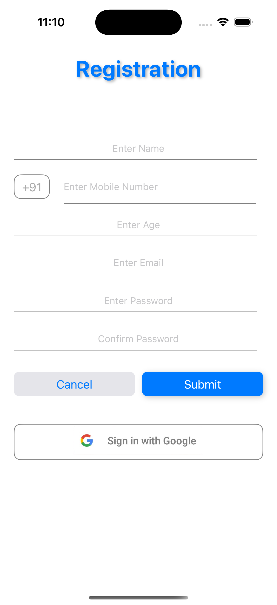
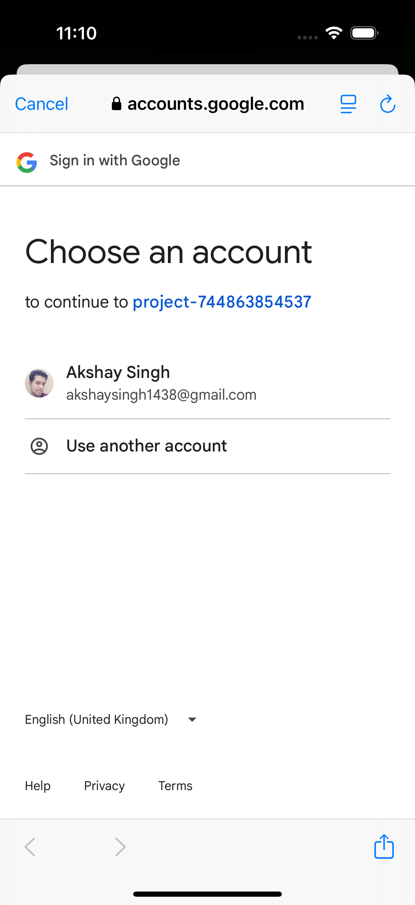
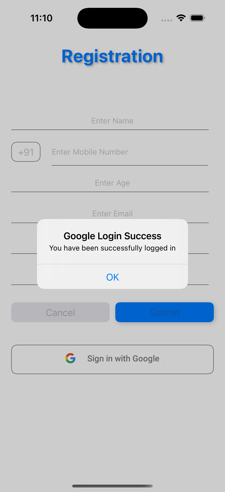

# 📱 MVVM iOS App

An iOS application built using the **Model-View-ViewModel (MVVM)** architecture. This project demonstrates clean code practices, separation of concerns, and integrates essential iOS features such as API requests, user registration, Google Sign-In, and loading indicators.

---

## 🚀 Features

- ✅ Clean MVVM architecture using UIKit + Combine
- ✅ User registration with form validation
- ✅ Google Sign-In integration
- ✅ Country code picker UI
- ✅ Modular network layer using URLSession
- ✅ Ready for unit testing and scaling
- ✅ Swift 5 based, lightweight and fast

---

## 🏗️ Architecture Overview

- **ViewController**: Handles UI & observes ViewModel
- **ViewModel**: Holds state and business logic
- **Service Layer**: API handling with `URLSession`
- **Models**: Structs to decode/encode API data

---

## 📦 Folder Structure

📁 MVVMApp/

├── 📁 Models/ # Data models

├── 📁 ViewModels/ # ViewModel logic

├── 📁 Views/ # ViewControllers and UI

├── 📁 Services/ # Networking layer

├── 📁 Extensions/ # Helper extensions

├── 📁 Resources/ # Assets, JSONs, etc.

└── AppDelegate.swift / SceneDelegate.swift


---

## 🛠️ Tech Stack

| Technology      | Purpose                          |
|----------------|----------------------------------|
| Swift 5         | Core language                    |
| UIKit           | UI layer                         |
| MVVM            | Architecture pattern             |
| Combine         | Data binding                     |
| URLSession      | API networking                   |
| FirebaseAuth    | Google Sign-In                   |

---

## 📲 Screenshots

| Registration Screen | Google Sign-In | Success GoogleSignIN |
|---------------------|----------------|----------------|
|  |  |  |

> - `registration.png`
> - `google_signin.png`
> - `success.png`

---

## 🔄 Getting Started

### 1. Clone the Repository

```bash
git clone https://github.com/akshay7137/MVVM.git

## Please add your own googleservice-info.plist file.
you can get that from firebase -> Go to Console -> create app.
After you created your app success fully then go to Authentication -> Google -> Enable Google -> download googleservice-info.plist file.
Add that file in the project and make the change in url schema withreversed-api-key.
Run the project and enjoy.


